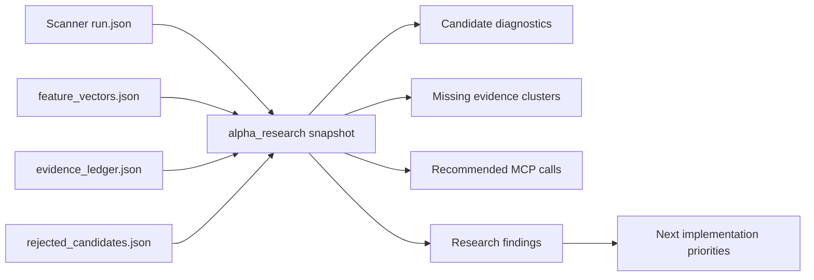

# 알파스캐너 분석 강화 MCP 연구 개발 계획

작성일: 2026-05-24  
대상: MarketFlow / MiroFish Alpha Scanner  
목적: AI 주식분석 도구를 통해 forward profit potential이 높은 종목을 더 정확히 검출하고, 나쁜 후보를 더 일찍 제거하며, Top 3 자동화 결과를 사후 검증 가능한 구조로 만든다.

---

## 1. 결론

알파스캐너의 궁극적 목적은 MCP 자동화가 아니다. 목적은 정확한 데이터를 기반으로 수익 가능성이 높은 종목을 검출하고, 위험하거나 근거가 약한 후보를 빨리 제거하며, 검출 결과를 사후성과로 검증하는 것이다.

MCP는 이 목적을 돕는 보조 계층이다. MCP는 데이터 수집, 근거 진단, 자동 실행, 아티팩트 조회, 사후성과 검증을 표준화하지만, 좋은 종목 검출보다 앞서면 안 된다.

이번 R&D의 1차 구현은 live ranking을 바로 바꾸지 않고, 알파스캐너 결과를 읽어 분석 품질을 진단하는 read-only MCP 계층을 추가하는 것이다.

새로 붙인 기능:

- `alpha_research` 서비스
- Flask API:
  - `GET /api/admin/mirofish/scanner/research`
  - `GET /api/admin/mirofish/scanner/runs/{run_id}/research`
- FastMCP tool/resource:
  - `get_alpha_research_snapshot`
  - `mirofish://scanner/research`

이 기능은 최신 scanner run의 후보, feature vector, evidence ledger, rejected candidates를 읽고 다음 항목을 구조화한다.

- 후보별 강점과 리스크
- 부족한 근거 클러스터
- 다음에 호출해야 할 MCP 도구
- KIS/KRX 수급, DART 이벤트, TradingView 확인, 성과검증 자동화 우선순위
- scanner score를 바꿀 준비가 됐는지 여부

중요한 원칙은 다음과 같다.

- LLM은 숫자를 만들지 않는다.
- MCP는 데이터와 진단을 제공한다.
- live ranking 변경은 forward outcome 검증 이후에만 진행한다.
- 자금 흐름 확인 전까지 BUY 후보의 확신도는 제한한다.

---

## 2. 외부 리서치 기반 우선순위

| 우선순위 | 분석 강화 항목 | 데이터/도구 | 적용 방식 | 기대효과 |
|---:|---|---|---|---|
| P0 | KRX/KIS/Kiwoom 수급 확인 | KRX Open API, KIS API, Kiwoom investor trend | 외국인/기관 순매수, 거래대금 대비 순매수, 연속성 점수 | 가격 모멘텀 단독 오탐 감소 |
| P0 | 근거 클러스터 진단 | scanner evidence ledger | 가격/거래량/수급/공시/기술/성과 근거 수 확인 | weak evidence 후보 확신도 제한 |
| P1 | DART 이벤트 리스크 | OpenDART | 증자, CB/BW, 감사, 최대주주, 실적 공시 태깅 | 이벤트성 함정 후보 제거 |
| P1 | QVM + 모멘텀 복합 랭킹 | 가격/거래대금/재무/섹터 데이터 | Quality, Value, Momentum 분리 점수 | 테마 과열과 실적 기반 후보 분리 |
| P1 | 사후성과 검증 | outcome tracker, feature vectors | T+5/T+20 hit rate, tag별 성과 | live weight 변경 전 검증 |
| P2 | TradingView 확인 | TradingView MCP/cache | 기술적 확인 보조 신호 | 추세 확인 보강 |
| P2 | 뉴스/검색 관심도 | GDELT, Naver DataLab | 미확인 신호로만 사용 | 과열/관심 급증 감지 |
| P3 | Purged CV/DSR | backtest/eval layer | 과최적화 방지 | 장기 안정화 |

참고 리소스:

- Model Context Protocol: https://modelcontextprotocol.io/
- KRX Open API: https://openapi.krx.co.kr/contents/OPP/MAIN/main/index.cmd
- OpenDART: https://opendart.fss.or.kr/
- KIS Developers: https://apiportal.koreainvestment.com/
- FinanceDataReader: https://github.com/FinanceData/FinanceDataReader
- vectorbt: https://vectorbt.dev/
- Alphalens: https://github.com/quantopian/alphalens
- MLflow: https://mlflow.org/

---

## 3. 구현된 MCP 진단 흐름



`get_alpha_research_snapshot`은 다음을 반환한다.

- `quality`: evidence grade, source count, confidence cap, stale source 상태
- `factor_profile`: 평균 alpha/risk, trend/volume/volatility, tag/source 분포
- `candidate_diagnostics`: 후보별 강점, 리스크, 부족 근거, 추천 MCP 호출
- `research_findings`: P0/P1/P2 개선점
- `automation_mcp_blueprint`: 구현된 도구와 다음 도구 설계

---

## 4. 알파 검출력 강화 방향

### 4.1 Capital Flow Confirmation

현재 알파스캐너는 가격/거래량/VCP/종가베팅/TradingView 확인을 사용하지만, 한국장에서 중요한 외국인/기관 수급 확인은 아직 core score에 충분히 들어가 있지 않다.

다음 구현:

```text
flow_confirmation_score =
  foreign_net_buy_to_turnover
+ institution_net_buy_to_turnover
+ foreign_futures_alignment
+ program_trading_direction
+ consecutive_accumulation_days
- flow_price_divergence_penalty
```

운영 규칙:

- 가격 상승 + 외국인/기관 동반 유입: confidence cap 상향 가능
- 가격 상승 + 수급 미확인: confidence cap 유지
- 가격 상승 + 외국인/기관 이탈: risk_score 상향

### 4.2 DART Event Risk

OpenDART는 BUY 후보의 “급등 이유”와 “함정 이벤트”를 분리하는 데 중요하다.

필터링 대상:

- 유상증자
- 전환사채/신주인수권부사채
- 최대주주 변경
- 감사의견/소송/상장폐지 위험
- 공급계약/수주/실적 공시

### 4.3 Outcome-Calibrated Scoring

현재 outcome feedback은 advisory로만 존재한다. 다음 단계는 score를 직접 바꾸기 전에 아래 리포트를 만든다.

- strategy tag별 hit rate
- alpha bucket별 forward return
- risk bucket별 false positive
- market별 성과
- T+5/T+20 horizon별 성과

live ranking에 반영할 때는 delta를 작게 제한한다.

```text
ranking_score_v2 =
  ranking_score_v1
+ bounded_flow_delta
+ bounded_dart_delta
+ bounded_outcome_delta
- uncertainty_penalty
```

---

## 5. 다음 구현 순서

1. `score_candidate_flow_confirmation`
   - KIS/KRX/Kiwoom 수급 데이터를 후보별로 붙인다.
   - read-only provider로 시작한다.

2. `get_dart_event_risk`
   - OpenDART 캐시/공시 이벤트를 후보별 risk tag로 정규화한다.

3. `run_factor_validation_report`
   - feature vector와 forward outcome을 연결해 tag별 성과를 계산한다.

4. `alpha_score_v2` shadow scoring
   - live ranking은 유지하고 v2 score를 artifact로만 저장한다.

5. UI 노출
   - Admin endpoints의 Alpha Board에 evidence cluster, flow missing, DART risk, outcome sample 상태를 표시한다.

---

## 6. 운영 원칙

- 모든 데이터는 `source`, `fetched_at`, `freshness`, `confidence`를 갖는다.
- C/D급 뉴스·SNS·검색 관심도는 단독 BUY 근거가 될 수 없다.
- 결과는 항상 특정 종목/코드/시장에 귀속한다.
- scanner score 변경은 테스트와 사후성과 검증을 통과한 뒤 반영한다.
- MiniPC 운영 데이터, 회원 DB, 시크릿은 배포 중 절대 덮어쓰지 않는다.
