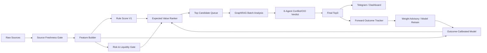

# Alpha Scanner R&D Deep Research

작성일: 2026-05-20  
대상: MarketFlow / MiroFish Alpha Scanner  
목표: AI 주식분석 도구를 통해 전 시장에서 forward profit potential이 높은 종목을 검출, 검증, 감시하고 Top 3로 자동 선별한다.

---

## 1. 핵심 결론

알파 스캐너의 다음 단계는 더 많은 LLM 호출이 아니라, **데이터 신선도, 수급 확인, 거래량/가격 구조, 리스크 필터, 사후 성과검증을 하나의 확률형 랭킹 엔진으로 묶는 것**이다.

현재 스캐너는 이미 파일 기반 결정론 점수, source freshness gate, TradingView 보강, GraphRAG Top3 workflow, Telegram monitor, outcome tracker를 갖고 있다. 따라서 신규 개발은 아래 순서가 가장 효과적이다.

1. `Alpha Score`를 고정 점수에서 **성과검증 기반 expected value score**로 진화시킨다.
2. 각 후보별로 “왜 통과/탈락했는지”를 저장하는 **evidence ledger**를 만든다.
3. KIS/TradingView/KRX/DART/뉴스/검색트렌드 데이터를 **source confidence + freshness**와 함께 피처화한다.
4. `T+1/T+3/T+5/T+20/T+60` 사후성과를 자동 라벨링하여 스캐너 가중치를 보정한다.
5. LLM은 숫자 생성이 아니라 **근거 요약, 충돌검증, 리스크 설명, 사용자용 리포트**에만 사용한다.

---

## 2. 현재 코드베이스 진단

### 현재 강점

- `app/services/mirofish/alpha_scanner.py`
  - watched source file 정책이 존재한다.
  - `daily_prices.csv`, `screener_leading_latest.json`, `vcp_kr_latest.json`, `jongga_v2_latest.json` 등 핵심 입력의 freshness를 판단한다.
  - `alpha_score - 0.55 * risk_score + conviction_adjustment` 랭킹 구조가 존재한다.
  - TradingView MCP 보강이 fail-open 방식으로 연결되어 있다.
- `app/services/mirofish/workflow.py`
  - scanner event를 GraphRAG batch analysis로 넘기고 Top3를 선별하는 workflow가 존재한다.
  - Top3 Telegram message와 outcome attach가 이미 설계되어 있다.
- `app/services/mirofish/outcome_tracker.py`
  - workflow 결과의 forward outcome을 저장하고 Top3 hit rate를 집계할 수 있다.
- 테스트가 이미 좋은 방향이다.
  - source freshness blocking
  - realtime monitor retry
  - Telegram failure state defer
  - TradingView cached confirmation/warning
  - workflow Top3 / outcome

### 현재 한계

- alpha/risk score는 아직 **고정 규칙 기반**이다. 실제 성과가 가중치에 충분히 피드백되지 않는다.
- 후보별 feature vector가 표준화되어 있지 않아, 사후 검증과 모델 학습에 바로 쓰기 어렵다.
- KIS/TradingView/DART/news 등 외부 신호는 source별 confidence로 통합되지만, 아직 **확률 보정(calibration)** 구조가 약하다.
- “좋은 후보를 더 잘 찾는가?”를 검증하는 KPI가 UI와 API에 충분히 드러나지 않는다.
- 후보 탈락 이유, bad candidate filter, false positive 원인 분석이 별도 리포트로 축적되지 않는다.

---

## 3. 리서치 기반 강화 방향

### 3.1 Momentum + Volume은 핵심 축으로 유지

Jegadeesh & Titman(1993)은 과거 winner가 3~12개월 구간에서 상대적으로 좋은 성과를 냈다는 모멘텀 근거를 제시한다. Lee & Swaminathan(2000)은 거래량이 가격 모멘텀의 크기와 지속성을 설명하는 정보가 될 수 있음을 보인다.

적용:

- 현재 `price_momentum`, `trend_quality`, `volume_accumulation`은 유지한다.
- 다만 단순 상승률보다 아래 지표를 추가한다.
  - `relative_momentum_20d_vs_market`
  - `relative_momentum_60d_vs_sector`
  - `volume_dry_up_then_expansion`
  - `breakout_with_volume_confirmation`
  - `momentum_reversal_risk`
  - `gap_chase_risk`

### 3.2 Capital flow confirmation을 우선순위로 올림

사용자의 시스템 프롬프트 원칙과도 일치한다. 가격 상승만으로는 신뢰도가 낮고, 외국인/기관/프로그램/ETF/파생 수급 확인이 붙어야 높은 점수를 부여해야 한다.

적용:

- KIS API 또는 KRX 데이터로 다음 피처를 추가한다.
  - 외국인 순매수 강도
  - 기관 순매수 강도
  - 프로그램 매매 방향
  - 시장/업종 대비 거래대금 증가
  - 선물/지수 방향과 개별주 신호의 정합성
- `flow_confirmation_score`를 alpha score 핵심 클러스터로 승격한다.
- 가격은 강하지만 수급 확인이 없으면 `confidence_cap`을 둔다.

### 3.3 LLM은 판단 엔진이 아니라 evidence compressor

LLM이 가격, 점수, 수급 값을 만들어내면 알파 검출 시스템이 약해진다. LLM은 아래 역할로 제한한다.

- DART 공시 요약
- 뉴스/이슈의 bullish/base/bearish 근거 분류
- GraphRAG 관계 설명
- 후보 탈락/통과 사유 요약
- 6 Agent conflict report 작성

수치 계산, 랭킹, Top3 선별은 deterministic pipeline + calibrated model이 담당해야 한다.

### 3.4 사후성과 기반 adaptive scoring

현재 outcome tracker가 있으므로 가장 큰 개선 포인트는 여기다.

추천 구조:

```text
scanner candidate
  -> feature_vector.json
  -> GraphRAG/CIO verdict
  -> Top3
  -> outcome labels T+1/T+3/T+5/T+20/T+60
  -> hit/miss/MAE/MFE/benchmark-relative return
  -> weight advisory
  -> calibrated alpha_score_v2
```

핵심은 “지난 추천이 맞았는가?”가 아니라, **어떤 feature 조합이 어떤 horizon에서 먹혔는가**를 저장하는 것이다.

---

## 4. 무료/저비용 리소스 후보

| 리소스 | 용도 | 적용 우선순위 | 주의 |
|---|---|---:|---|
| KIS Open API / KIS Trading MCP | 실시간/준실시간 시세, 투자자 매매동향, 순위정보, 프로그램매매 | P0 | 호출 제한/토큰 관리 필수 |
| OpenDART | 공시 검색, 기업개황, 원문 공시 | P1 | corp code mapping 필요 |
| KRX Open API / Data Marketplace | 거래소 공식 시장 데이터, ETF/ETN/파생/공매도 계열 확장 | P1 | 인증키/상품별 이용조건 확인 |
| 공공데이터포털 금융위/KRX 가격 API | 보조 가격/거래량 데이터 | P1 | 지연/정합성 확인 필요 |
| Naver DataLab | 검색 관심도, 테마 과열 감지 | P2 | C급 보조 신호, 단독 매수 근거 금지 |
| GDELT DOC API | 글로벌 뉴스 모니터링, 이슈 확산 감지 | P2 | 한국 종목명/영문명 매핑 필요 |
| BOK ECOS | 금리, 환율, 유동성, 매크로 레짐 | P2 | 일/월 빈도 혼합 처리 |
| FRED | DXY proxy, 미국 금리/유동성/신용 스프레드 | P2 | 한국 장중 신호와 시간차 있음 |
| VectorBT | 빠른 대량 백테스트/파라미터 검증 | P1 | look-ahead bias 방지 래퍼 필요 |
| MLflow | 실험/가중치/성과 추적 | P2 | 로컬 파일 기반부터 시작 가능 |
| River | 장중 이벤트/온라인 학습/드리프트 감지 | P3 | 충분한 데이터 축적 후 적용 |

---

## 5. Alpha Scanner V2 아키텍처



### 필수 산출물

각 scanner run마다 아래 파일을 저장한다.

```text
data/admin_mirofish/scanner_runs/{run_id}/
  run.json
  candidates.json
  feature_vectors.json
  rejected_candidates.json
  evidence_ledger.json
  model_scores.json
  freshness.json
  backtest_context.json
```

---

## 6. Score 설계안

### 6.1 alpha_score_v2

```text
alpha_score_v2 =
  0.22 * relative_momentum
+ 0.18 * volume_quality
+ 0.18 * flow_confirmation
+ 0.12 * source_convergence
+ 0.10 * breakout_structure
+ 0.08 * news_disclosure_quality
+ 0.07 * sector_regime_alignment
+ 0.05 * tradingview_confirmation
```

### 6.2 risk_score_v2

```text
risk_score_v2 =
  overextension_risk
+ gap_chase_risk
+ liquidity_risk
+ stale_source_risk
+ single_source_risk
+ event_uncertainty_risk
+ volatility_spike_risk
+ poor_outcome_history_risk
```

### 6.3 final_expected_value_score

```text
final_score =
  calibrated_upside_probability * expected_reward
- calibrated_drawdown_probability * expected_loss
+ evidence_quality_bonus
- uncertainty_penalty
```

이 점수는 사용자가 원하는 “수익 후보 종목 검출” 목적에 가장 직접적으로 맞다.

---

## 7. 엔드포인트 설계

### Admin

| Endpoint | Method | 목적 |
|---|---|---|
| `/api/admin/mirofish/scanner/features/latest` | GET | 최신 run feature vector 확인 |
| `/api/admin/mirofish/scanner/runs/{run_id}/evidence` | GET | 후보별 근거 ledger |
| `/api/admin/mirofish/scanner/runs/{run_id}/rejects` | GET | 탈락 후보와 탈락 이유 |
| `/api/admin/mirofish/scanner/backtest` | POST | 기간/전략/horizon 기반 replay-safe 백테스트 |
| `/api/admin/mirofish/scanner/performance` | GET | hit rate, forward return, false positive 집계 |
| `/api/admin/mirofish/scanner/model/status` | GET | 현재 가중치, 캘리브레이션, 마지막 학습 상태 |
| `/api/admin/mirofish/scanner/model/retrain` | POST | outcome 기반 weight advisory/retrain |
| `/api/admin/mirofish/scanner/regime` | GET | 매크로/시장 레짐 상태 |

### Subscriber / AI Brain

| Endpoint | Method | 목적 | 제한 |
|---|---|---|---|
| `/api/mirofish/scanner/top3/latest` | GET | 최신 Top3 요약 | AI Brain 이상 |
| `/api/mirofish/scanner/candidates/latest` | GET | 후보 요약 | AI Brain 이상, 민감 점수 일부 마스킹 |
| `/api/mirofish/graphrag/runs` | POST | 구독자용 분석 run 생성 | 일일 횟수/동시 실행/캐시 재사용 |
| `/api/mirofish/scanner/performance/public` | GET | 최근 성과 요약 | 민감 내부 피처 제외 |

---

## 8. 백테스트/검증 설계

### 반드시 지킬 원칙

- look-ahead bias 금지
- 추천 시점 이후 데이터만 outcome으로 사용
- entry date, entry price, horizon, cost/slippage, benchmark를 저장
- Top3 기준과 전체 후보 기준을 분리
- false positive와 missed winner를 모두 기록

### KPI

| KPI | 의미 |
|---|---|
| Top3 T+5 hit rate | 단기 추천 적중률 |
| Top3 T+20 excess return | 시장 대비 중기 초과성과 |
| MFE / MAE | 최대 유리/불리 움직임 |
| false positive rate | BUY_CANDIDATE였으나 실패 |
| missed winner rate | 후보권 밖에서 급등한 종목 |
| freshness failure rate | 데이터 신선도 때문에 차단된 비율 |
| Telegram actionable rate | 전송된 신호 중 실제 분석/관찰 가치 |

---

## 9. 구현 우선순위

### P0: 즉시 효과

1. `feature_vectors.json` 저장.
2. `rejected_candidates.json` 저장.
3. candidate마다 `evidence_quality`, `confidence_cap`, `source_count`, `freshness_penalty`를 명시.
4. Top3 final verdict에 target symbol/name/market/date를 항상 표시.
5. outcome tracker 결과를 scanner scoring advisory로 연결.

### P1: 분석력 강화

1. KIS 투자자별 매매동향/프로그램매매/거래대금 순위 피처 추가.
2. DART 이벤트 분류기 추가.
3. TradingView signal을 단순 가산점이 아니라 trend conflict gate로 승격.
4. VectorBT 기반 replay-safe batch backtest runner 추가.
5. scanner performance dashboard 추가.

### P2: 외부 신호 확장

1. KRX ETF/공매도/파생 보조 신호.
2. Naver DataLab 검색 관심도 과열/확산 탐지.
3. GDELT 글로벌 이슈 연결.
4. BOK/FRED 매크로 regime feed.

### P3: 적응형 모델

1. MLflow 또는 파일 기반 experiment tracker.
2. logistic calibration / isotonic calibration.
3. River 기반 online drift detector.
4. 시장 레짐별 가중치 분리.

---

## 10. 실무 개발 순서

1. `alpha_scanner.py`에서 candidate 생성 직후 표준 feature vector를 만든다.
2. 현재 alpha/risk 산식 결과와 함께 `model_inputs`를 저장한다.
3. workflow/outcome tracker가 horizon별 label을 저장하게 확장한다.
4. `scanner/performance` API를 만들어 최근 30/60/90일 Top3 성과를 노출한다.
5. 성과가 좋았던 feature 조합과 나빴던 feature 조합을 weight advisory로 산출한다.
6. KIS 수급 피처를 추가한다.
7. DART/news/검색트렌드는 단독 점수보다 confidence modifier로만 적용한다.
8. UI에는 Top3뿐 아니라 “탈락 후보”, “근거 부족 후보”, “수급 미확인 후보”를 보여준다.

---

## 11. 참고 소스

- KIS Developers Open API: https://apiportal.koreainvestment.com/
- KIS Open API GitHub / MCP / backtester: https://github.com/koreainvestment/open-trading-api
- OpenDART 개발가이드: https://opendart.fss.or.kr/guide/main.do?apiGrpCd=DE001
- KRX Open API Terms: https://openapi.krx.co.kr/contents/OPP/INFO/OPPINFO005.jsp
- Naver DataLab Search Trend API: https://developers.naver.com/docs/serviceapi/datalab/search/search.md
- GDELT DOC 2.0 API: https://blog.gdeltproject.org/gdelt-doc-2-0-api-debuts/
- VectorBT documentation: https://vectorbt.dev/
- MLflow Tracking: https://mlflow.org/docs/latest/ml/tracking/
- Jegadeesh & Titman, 1993: https://ideas.repec.org/a/bla/jfinan/v48y1993i1p65-91.html
- Lee & Swaminathan, Price Momentum and Trading Volume: https://papers.ssrn.com/sol3/papers.cfm?abstract_id=92589

