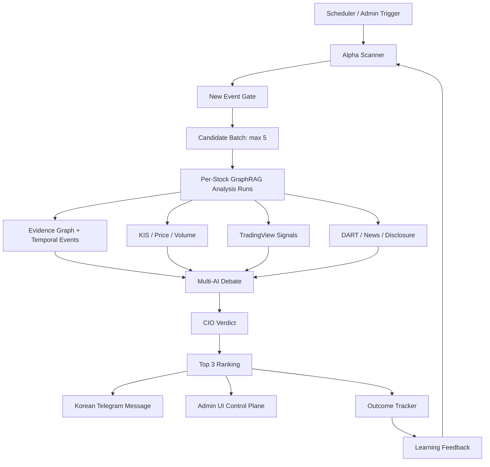
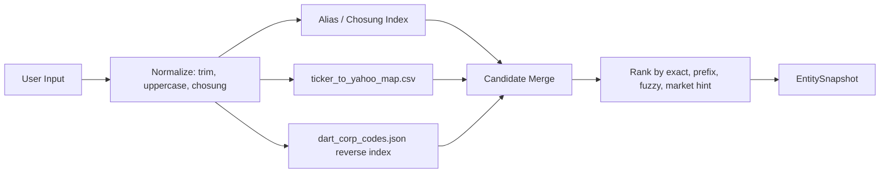
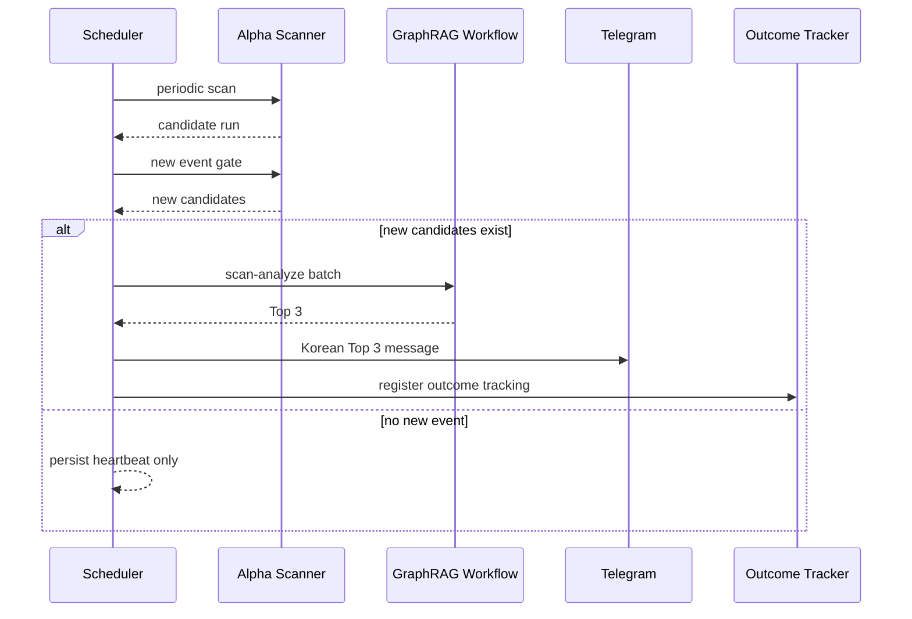

# MiroFish GraphRAG Analysis Endpoint Implementation Blueprint

**문서 버전:** 1.0  
**작성일:** 2026-05-14  
**비교 검토 대상:**  
- `docs/mirofish_graphrag_analysis_endpoint_design_2026_05_14.md`
- `docs/mirofish_graphrag_analysis_endpoint_design_review_2026_05_14.md`

**작성 목적:** 기존 설계안과 비교 검토 보고서를 통합해, 현재 MarketFlow 코드베이스에 바로 붙일 수 있는 관리자 전용 GraphRAG Analysis 설계도를 정의한다.

---

## 0. 핵심 결론

기존 설계안의 방향성은 좋지만, 실제 구현 설계는 다음처럼 보정해야 한다.

1. 신규 `/api/graphrag/*` 네임스페이스를 만들지 않는다. 관리자 전용 MiroFish 기능이므로 `/api/admin/mirofish/graphrag/*` 아래에 붙인다.
2. 서비스도 `app/services/graphrag/*` 로 분리하지 않고 `app/services/mirofish/graphrag/*` 로 둔다. 기존 alpha scanner, workflow, store, MCP server 와 같은 운영 경계 안에 있어야 한다.
3. 목표는 범용 GraphRAG 연구가 아니라 수익 후보 종목 검출이다. 따라서 `scanner -> batch GraphRAG -> Top 3 -> Telegram -> outcome tracking -> learning feedback` 이 1급 워크플로우가 된다.
4. 기존 리뷰 문서가 지적한 대로 Multi-AI 자산은 2-AI 가 아니라 `Gemini + OpenAI + Grok + Claude Devil's Advocate` 로 정의한다.
5. 모든 수치와 판정은 출처, 시점, 신선도, 캐시 여부를 남긴다. LLM 은 숫자를 해석할 수 있지만 숫자를 창작하면 안 된다.

---

## 1. 현재 코드베이스 기준 정합성

### 1.1 실제 운영 경로

현재 MiroFish 운영 경로는 다음과 같다.

| 영역 | 실제 경로 |
|---|---|
| Flask route | `app/routes/admin_mirofish.py` |
| MiroFish services | `app/services/mirofish/` |
| GraphRAG run artifact | `data/admin_mirofish/runs/{run_id}/` |
| Scanner workflow artifact | `data/admin_mirofish/workflows/{workflow_id}/` |
| Frontend API client | `frontend-react/src/lib/mirofishApi.ts` |
| Admin UI | `frontend-react/src/pages/admin/AdminEndpointsPage.tsx` |
| MCP server | `app/services/mirofish/mcp_server.py` |

### 1.2 이미 존재하는 핵심 엔드포인트

| 목적 | 현재 엔드포인트 |
|---|---|
| 종목 검색 | `GET /api/admin/mirofish/targets/search` |
| 종목 resolve | `GET /api/admin/mirofish/targets/resolve` |
| 단일 GraphRAG run 생성 | `POST /api/admin/mirofish/runs` |
| run graph 조회 | `GET /api/admin/mirofish/runs/{run_id}/graph` |
| run event 조회 | `GET /api/admin/mirofish/runs/{run_id}/events` |
| scanner run 생성 | `POST /api/admin/mirofish/scanner/runs` |
| scanner monitor check | `POST /api/admin/mirofish/scanner/monitor/check` |
| scanner alert check | `POST /api/admin/mirofish/scanner/alerts/check` |
| scanner batch -> Top3 | `POST /api/admin/mirofish/workflow/scan-analyze` |
| workflow 조회 | `GET /api/admin/mirofish/workflows/{workflow_id}` |
| outcome 조회 | `GET /api/admin/mirofish/workflows/{workflow_id}/outcomes` |
| autonomous MCP 실행 | `POST /api/admin/mirofish/autonomous/scan-analysis` |
| Telegram 최신 workflow 전송 | `POST /api/admin/mirofish/autonomous/telegram/latest` |
| TradingView 상태 | `GET /api/admin/mirofish/tradingview/status` |
| price chart | `GET /api/admin/mirofish/price-chart/{symbol}` |

설계도는 이 경로들을 대체하지 않고 확장한다.

---

## 2. 목표 아키텍처



핵심은 scanner 가 종목을 찾고, GraphRAG 가 근거와 관계를 강화하며, Multi-AI 와 CIO 판정이 최종 Top 3 를 고르는 구조다.

---

## 3. 설계 원칙

| 원칙 | 설명 |
|---|---|
| Alpha first | GraphRAG 는 예쁜 그래프가 아니라 더 좋은 수익 후보를 찾기 위한 근거 엔진이다. |
| Admin only | 모든 신규 엔드포인트는 관리자 전용이다. |
| Existing workflow first | 기존 `/workflow/scan-analyze` 를 중심 워크플로우로 유지하고 확장한다. |
| Evidence required | 최종 판정에는 항상 종목명, 종목코드, 시장, 기준일, 출처, 신선도, confidence 가 포함된다. |
| No invented numbers | 가격, 거래량, 수급, 점수는 API, 파일, 계산식에서만 온다. |
| Replay safe | 백테스트와 사후 검증은 look-ahead bias 를 금지한다. |
| Freshness visible | live, cached, stale 상태를 UI 와 artifact 에 모두 남긴다. |
| Gradual storage | SQLite + JSONL 로 시작하고, 필요할 때 KuzuDB 또는 Neo4j 로 이전한다. |

---

## 4. URL 설계

### 4.1 관리자 GraphRAG 하위 네임스페이스

신규 엔드포인트는 다음 prefix 를 사용한다.

```text
/api/admin/mirofish/graphrag/*
```

권장 route 파일:

```text
app/routes/admin_mirofish_graphrag.py
```

등록:

```python
app.register_blueprint(
    admin_mirofish_graphrag_bp,
    url_prefix='/api/admin/mirofish/graphrag',
)
```

모든 route 는 `@admin_required` 를 사용한다.

### 4.2 신규 엔드포인트 목록

| Phase | Method | Path | 목적 |
|---|---|---|---|
| 0 | GET | `/status` | GraphRAG subsystem 상태 |
| 0 | GET | `/entities/resolve` | ticker, 한글명, corp_code, yahoo ticker 를 표준 entity 로 변환 |
| 0 | GET | `/entities/{entity_id}` | entity 메타와 연결 통계 |
| 1 | POST | `/query/route` | local, global, drift, event, numeric 질의 라우팅 |
| 1 | POST | `/search` | vector + graph + tool 하이브리드 검색 |
| 1 | GET | `/subgraph/{entity_id}` | k-hop 시간 필터 서브그래프 |
| 2 | GET | `/events` | 종목별 disclosure, news, pattern, scanner event timeline |
| 2 | POST | `/events/ingest` | 내부 ETL 또는 관리자 이벤트 적재 |
| 3 | GET | `/communities` | 섹터, 테마, 공급망 community 목록 |
| 3 | GET | `/communities/{community_id}/summary` | community narrative summary |
| 4 | POST | `/research` | 단일 질문 기반 agentic GraphRAG research |
| 4 | GET | `/research/{run_id}` | research 결과와 audit trail |
| 5 | POST | `/eval/run` | replay-safe 평가 실행 |
| 5 | GET | `/metrics` | 그래프 품질, stale ratio, source coverage |

### 4.3 기존 workflow 확장

기존 핵심 엔드포인트는 유지한다.

```text
POST /api/admin/mirofish/workflow/scan-analyze
```

payload 확장:

```json
{
  "limit": 20,
  "max_events": 5,
  "top_n": 3,
  "agent_count": 10,
  "max_parallel": 3,
  "min_alpha": 50,
  "max_risk": 65,
  "graphrag_mode": "hybrid_temporal",
  "source_policy": "fresh_or_cached_with_warning",
  "include_tradingview": true,
  "include_kis": true,
  "send_telegram": true,
  "commit_event_state": true
}
```

workflow 결과 확장:

```json
{
  "id": "mcp_...",
  "type": "scanner_event_graphrag_batch_top3",
  "status": "completed",
  "scanner_run_id": "mfas_...",
  "event_count": 5,
  "analysis_runs": [],
  "top3": [],
  "graphrag": {
    "mode": "hybrid_temporal",
    "entity_count": 103,
    "edge_count": 135,
    "source_coverage": {
      "scanner": "live",
      "kis": "live",
      "tradingview": "cached",
      "dart": "cached",
      "news": "stale_warning"
    }
  },
  "telegram": {
    "requested": true,
    "sent": true,
    "sent_at": "2026-05-14T09:20:00+09:00"
  },
  "outcome_summary": {
    "lookahead_safe": true,
    "status": "pending"
  }
}
```

---

## 5. Entity Resolve 설계

### 5.1 입력 유형

| 입력 | 예시 | 처리 |
|---|---|---|
| 한글 정식명 | `삼성전자` | `ticker_to_yahoo_map.csv` name 매칭 |
| 한글 약어 | `삼전`, `하닉` | `korean_aliases.json` + fuzzy match |
| 초성 | `ㅅㅅㅈㅈ`, `ㄷㅅ` | 초성 index |
| ticker | `005930` | ticker direct |
| yahoo ticker | `005930.KS` | suffix 제거 후 market 추론 |
| corp_code | `00126380` | `dart_corp_codes.json` 역방향 index |

### 5.2 표준 entity_id

```text
KR: kr:{ticker}
US: us:{symbol}
Crypto: crypto:{symbol}
Sector: sec:{market}:{slug}
Event: evt:{source}:{date}:{hash}
Document: doc:{source}:{date}:{hash}
```

예:

```text
kr:005930
us:NVDA
crypto:BTC
sec:kr:semiconductor
evt:dart:00126380:20260514:8d79d5
```

### 5.3 join 흐름



### 5.4 응답 예시

```json
{
  "query": "두산",
  "matches": [
    {
      "entity_id": "kr:000150",
      "name": "두산",
      "symbol": "000150",
      "market": "KOSPI",
      "yahoo_ticker": "000150.KS",
      "corp_code": "00159616",
      "confidence": 0.98,
      "match_reason": "exact_name"
    },
    {
      "entity_id": "kr:034020",
      "name": "두산에너빌리티",
      "symbol": "034020",
      "market": "KOSPI",
      "confidence": 0.86,
      "match_reason": "prefix_name"
    },
    {
      "entity_id": "kr:454910",
      "name": "두산로보틱스",
      "symbol": "454910",
      "market": "KOSPI",
      "confidence": 0.83,
      "match_reason": "prefix_name"
    }
  ],
  "asof": "2026-05-14T09:00:00+09:00",
  "source": "ticker_map+dart_codes"
}
```

---

## 6. GraphRAG 데이터 모델

### 6.1 노드

| Node | 필수 필드 |
|---|---|
| COMPANY | entity_id, name, symbol, market, exchange, sector, ids |
| EVENT | event_id, type, subtype, observed_at, valid_from, valid_to, confidence |
| DOCUMENT | doc_id, source_type, url, title, published_at, content_hash, language |
| METRIC | metric_id, entity_id, metric, value, unit, period, asof |
| PRICE_BAR | bar_id, entity_id, date, open, high, low, close, volume |
| SIGNAL | signal_id, source, action, alpha_score, risk_score, generated_at |
| VERDICT | verdict_id, action, confidence_pct, horizon, created_at |
| COMMUNITY | community_id, type, name, generated_at |

### 6.2 엣지

| Edge | 방향 | 의미 |
|---|---|---|
| belongs_to | COMPANY -> SECTOR | 섹터 소속 |
| mentioned_in | COMPANY -> DOCUMENT | 문서 언급 |
| impacted_by | COMPANY -> EVENT | 이벤트 영향 |
| causes | EVENT -> EVENT | 이벤트 인과 |
| correlates_with | COMPANY -> COMPANY | 통계적 동행 |
| supplies_to | COMPANY -> COMPANY | 공급망 |
| competes_with | COMPANY -> COMPANY | 경쟁 관계 |
| has_metric | COMPANY -> METRIC | 재무/가격 지표 |
| generated_signal | COMPANY -> SIGNAL | 스캐너 시그널 |
| received_verdict | COMPANY -> VERDICT | CIO 판정 |

모든 edge 는 다음 필드를 가진다.

```json
{
  "valid_from": "2026-05-14",
  "valid_to": null,
  "observed_at": "2026-05-14T09:00:00+09:00",
  "evidence_doc_ids": [],
  "source": "scanner|kis|tradingview|dart|news|manual",
  "confidence": 0.0
}
```

---

## 7. 하이브리드 검색 설계

### 7.1 route taxonomy

| Route | 설명 | 예시 |
|---|---|---|
| local | 단일 종목 중심 | 삼성전자 GraphRAG 근거 |
| global | 섹터/시장 전역 | 반도체 공급망 현재 핵심 |
| drift | local + global 을 오가며 확장 | HBM 이벤트가 관련 장비주로 번지는 경로 |
| event | 최신 이벤트 중심 | 오늘 공시로 바뀐 후보 |
| numeric | 가격, 거래량, 수급, 재무 중심 | 거래량 급증과 알파 점수 관계 |
| risk | 악재, 과열, 유동성, 신선도 위험 | 이 후보를 걸러야 하는 이유 |

### 7.2 evidence merge

각 후보 종목의 근거는 다음 점수로 통합한다.

| 점수 | 비중 | 설명 |
|---|---:|---|
| scanner alpha | 25 | 기존 alpha scanner 점수 |
| graph evidence | 20 | graph path, event linkage, source count |
| catalyst freshness | 15 | 최근 이벤트 신선도와 중요도 |
| price volume | 15 | KIS, chart, volume ratio, trend |
| multi AI consensus | 15 | Gemini, OpenAI, Grok, Claude DA |
| risk control | 10 | risk score 역가중, stale penalty, volatility |

최종 점수는 artifact 에 식으로 남긴다.

```json
{
  "score_formula": "0.25*scanner_alpha + 0.20*graph_evidence + 0.15*catalyst_freshness + 0.15*price_volume + 0.15*multi_ai_consensus + 0.10*risk_control",
  "score_inputs": {
    "scanner_alpha": 86,
    "graph_evidence": 78,
    "catalyst_freshness": 71,
    "price_volume": 68,
    "multi_ai_consensus": 75,
    "risk_control": 57
  }
}
```

---

## 8. MCP 도구 설계

기존 `app/services/mirofish/mcp_server.py` 의 tool 들을 유지하고, 신규 tool 은 `graphrag_` prefix 를 강제한다.

### 8.1 Read-only tools

| MCP tool | HTTP 대응 | 설명 |
|---|---|---|
| `graphrag_get_status` | `GET /graphrag/status` | subsystem 상태 |
| `graphrag_resolve_entity` | `GET /graphrag/entities/resolve` | entity resolve |
| `graphrag_get_entity` | `GET /graphrag/entities/{id}` | entity 상세 |
| `graphrag_search` | `POST /graphrag/search` | 하이브리드 검색 |
| `graphrag_get_subgraph` | `GET /graphrag/subgraph/{id}` | 서브그래프 |
| `graphrag_list_events` | `GET /graphrag/events` | 이벤트 timeline |
| `graphrag_get_metrics` | `GET /graphrag/metrics` | 그래프 품질 |

### 8.2 Controlled tools

| MCP tool | 정책 |
|---|---|
| `graphrag_run_research` | read-heavy, artifact write 가능 |
| `run_autonomous_scan_analysis` | 기존 tool 유지, confirmation 필요 |
| `send_latest_workflow_telegram` | 기존 tool 유지, confirmation 필요 |

### 8.3 Excluded from MCP

| Endpoint | 제외 이유 |
|---|---|
| `POST /graphrag/events/ingest` | 내부 ETL/admin-only write |
| `POST /graphrag/eval/run` | 비용이 크고 운영 상태 변경 가능 |

---

## 9. Frontend 설계

### 9.1 AdminEndpointsPage 카드 구성

기존 `MiroFish x ASCII Brain` 영역에 다음 operational group 을 추가한다.

| Group | 카드 |
|---|---|
| GraphRAG Status | Status, Metrics, Source Freshness |
| Entity Layer | Resolve, Search Candidates, Chosung Index |
| Evidence Layer | Subgraph, Events, Documents |
| Workflow Layer | Scan Analyze, Latest Workflow, Top 3 Evidence |
| Delivery Layer | Telegram, Kakao Share, Outcome Board |
| Research Layer | Research Run, Research Detail |

### 9.2 Control Plane UI

UI 첫 화면은 다음 순서로 보여준다.

1. Market clock, scanner state, next scan time
2. Data freshness matrix: scanner, KIS, TradingView, DART, news, DeepSeek
3. Auto workflow status: scanner -> event queue -> GraphRAG -> Top3 -> Telegram -> outcome
4. Latest Top 3 cards with TradingView chart
5. Evidence graph panel
6. Event feed
7. Outcome tracking panel

### 9.3 Top 3 카드 필수 표시

각 Top 3 카드에는 다음 필드를 표시한다.

```text
종목명 / 종목코드 / 시장
현재가 / 기준일 / 데이터 출처
최종 판정 / 신뢰도 / 투자 horizon
Alpha score / Risk score / Final score
Graph links / evidence count / stale warning
KIS live 또는 cached
TradingView signal status
주요 근거 3개
주요 리스크 2개
```

---

## 10. Scheduler 설계

### 10.1 지속 자동감시

자동화는 1회성이 아니라 지속 감시다.



### 10.2 운영 조건

| 조건 | 정책 |
|---|---|
| 장중 | scanner 주기 단축, fresh source 우선 |
| 장마감 후 | summary, community, outcome refresh |
| stale source | 기본 차단, `allow_stale_sources=true` 일 때 경고 표시 |
| Telegram 실패 | workflow 는 완료 처리, delivery status 에 실패 기록 |
| scanner 오류 | watchdog message UTF-8 고정, retry backoff |

---

## 11. Artifact 설계

### 11.1 Run artifact

```text
data/admin_mirofish/runs/{run_id}/
  run.json
  graph.json
  report.json
  events.jsonl
  audit.json
```

### 11.2 Workflow artifact

```text
data/admin_mirofish/workflows/{workflow_id}/
  workflow.json
  top3.json
  evidence.json
  source_freshness.json
  telegram.json
  outcome.json
  audit.json
```

### 11.3 GraphRAG index artifact

```text
data/admin_mirofish/graphrag/
  entities.db
  aliases.json
  chosung_index.json
  edges/
    mentioned_in.jsonl
    impacted_by.jsonl
    supplies_to.jsonl
  events/
    2026-05-14.jsonl
  communities/
  research_runs/
  eval/
```

---

## 12. 구현 단계

### Phase A: 문서와 route skeleton

파일:

```text
app/routes/admin_mirofish_graphrag.py
app/services/mirofish/graphrag/__init__.py
app/services/mirofish/graphrag/schema.py
app/services/mirofish/graphrag/storage.py
```

완료 조건:

```text
GET /api/admin/mirofish/graphrag/status
```

가 `ready: true`, storage path, feature flags 를 반환한다.

### Phase B: Entity resolver

파일:

```text
app/services/mirofish/graphrag/resolver.py
app/services/mirofish/graphrag/korean.py
```

완료 조건:

```text
삼성전자, 삼성, 두산, ㄷㅅ, 005930, 005930.KS, corp_code
```

입력에 대해 복수 후보와 confidence 를 반환한다.

### Phase C: Workflow GraphRAG enrichment

파일:

```text
app/services/mirofish/workflow.py
app/services/mirofish/graphrag/enricher.py
```

완료 조건:

`workflow.json` 에 `graphrag`, `source_coverage`, `evidence_summary` 가 추가된다.

### Phase D: UI Control Plane

파일:

```text
frontend-react/src/lib/mirofishApi.ts
frontend-react/src/pages/admin/AdminEndpointsPage.tsx
```

완료 조건:

AdminEndpointsPage 에 GraphRAG status, freshness, Top3 evidence, chart 카드가 표시된다.

### Phase E: MCP exposure

파일:

```text
app/services/mirofish/mcp_server.py
```

완료 조건:

MCP read-only tools 에서 GraphRAG 상태, entity resolve, latest Top3 evidence 를 조회할 수 있다.

### Phase F: Eval and learning loop

파일:

```text
app/services/mirofish/graphrag/eval.py
app/services/mirofish/outcome_tracker.py
```

완료 조건:

look-ahead safe outcome 이 Top3 점수 조정에 advisory feedback 으로 반영된다.

---

## 13. 테스트 계획

### 13.1 Backend focused tests

```powershell
python -m pytest tests/test_admin_mirofish_service.py -q
python -m pytest tests/test_signal_contract.py -v
python -m pytest tests/test_admin_mirofish_graphrag.py -q
python -m compileall app/services/mirofish
```

신규 테스트:

| Test | 내용 |
|---|---|
| `test_graphrag_status_admin_required` | admin gate 확인 |
| `test_entity_resolve_exact_and_prefix` | 삼성, 두산 복수 후보 |
| `test_entity_resolve_chosung` | 초성 index |
| `test_workflow_enrichment_contract` | workflow artifact 확장 계약 |
| `test_source_freshness_visible` | stale/live/cached 노출 |
| `test_top3_verdict_has_target_identity` | 최종 판정 종목 식별 필수 |

### 13.2 Frontend checks

```powershell
Set-Location frontend-react
npm run test -- adminEndpointsEnter.test.tsx
npm run build
```

### 13.3 Manual app verification

| 확인 | 기준 |
|---|---|
| Admin page load | `/admin/endpoints` 정상 렌더 |
| GraphRAG status | error 가 아닌 ready/degraded/stale |
| Search | 두산 입력 시 두산, 두산에너빌리티, 두산로보틱스 표시 |
| Enter key | 검색창 Enter 로 분석 시작 |
| Workflow | scanner -> GraphRAG -> Top3 진행률 표시 |
| Telegram | 한국어 Top3 메시지 전송 |
| Chart | Top3 각 종목 TradingView/price chart 표시 |

---

## 14. 운영 정책

### 14.1 데이터 신선도

| 상태 | 의미 | UI |
|---|---|---|
| live | 현재 API 응답 | 녹색 |
| cached | TTL 내 캐시 | 파란색 |
| stale | TTL 초과 | 노란색 경고 |
| unavailable | 소스 실패 | 빨간색 |

### 14.2 판정 문구 정책

최종 판정은 반드시 대상 종목을 포함한다.

나쁜 예:

```text
최종 판정: BUY 75%
```

좋은 예:

```text
삼성전자(005930 KOSPI) 최종 판정: BUY 75%, 기준일 2026-05-14, KIS cached, GraphRAG evidence 135 links
```

### 14.3 Telegram 메시지 정책

메시지는 한글을 기본으로 한다.

```text
MiroFish MCP Top 3 자동 분석
신규 스캐너 이벤트를 다중 종목 GraphRAG 분석으로 처리했습니다.

워크플로우: ...
스캐너 실행: ...
이벤트: 5 / 분석 완료: 5 / 선별: Top 3
데이터 신선도: 신선

#1 삼성E&A (028050 KOSPI)
종합 점수: 84.05 / CIO 판정: 매수 75%
스캐너 알파/리스크: 86 / 43
GraphRAG 연결: 135 / Brain: 61 constructive_accumulation
가격: 64,400 KRW / 기준일: 2026-05-14
핵심 근거: ...
```

---

## 15. 구현 우선순위

### P0

1. `/api/admin/mirofish/graphrag/status`
2. entity resolver 고도화: 초성, 복수 후보, corp_code 역방향
3. workflow artifact 에 source freshness 와 graphrag summary 추가
4. 최종 판정에 종목명, 코드, 시장, 기준일 필수화

### P1

5. GraphRAG subgraph/events read endpoint
6. UI control plane 카드
7. MCP read-only tools
8. Top3 chart panel

### P2

9. community summary batch
10. research endpoint
11. eval harness
12. DART/news event ingest 자동화

---

## 16. 최종 설계 판정

비교 검토 보고서의 A- 평가는 타당하다. 다만 구현 관점의 최종 설계는 다음처럼 바뀐다.

| 기존 설계안 | 최종 설계도 |
|---|---|
| `/api/graphrag/*` | `/api/admin/mirofish/graphrag/*` |
| `app/services/graphrag/*` | `app/services/mirofish/graphrag/*` |
| GraphRAG 연구 API 중심 | Alpha scanner -> Top3 수익 후보 검출 중심 |
| Gemini + GPT-4o | Gemini + OpenAI + Grok + Claude Devil's Advocate |
| 단일 research endpoint 강조 | 지속 자동감시 workflow 강조 |
| 그래프 도입 | 수익 후보 근거, 리스크, 타이밍, 검증 강화 |

이 설계도는 바로 구현 계획으로 전환 가능하다. 첫 구현은 P0 네 가지부터 시작하는 것이 가장 안전하다.

