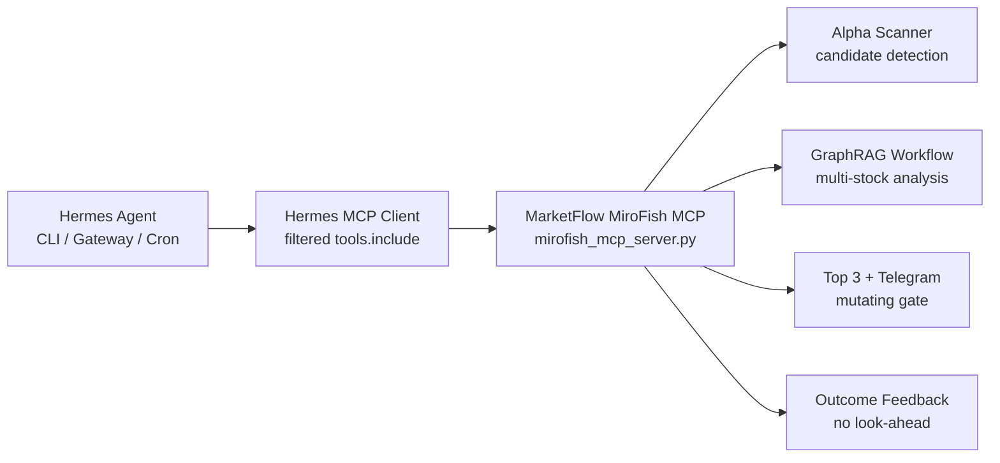

# MiroFish x Hermes Agent Sidecar Integration

## Decision

Hermes Agent can be attached to MarketFlow as an MCP client sidecar. The right integration is not to embed Hermes into the alpha scanner. The scanner remains the deterministic candidate engine, while Hermes gets a tightly filtered MCP surface for monitoring, dry-run planning, operator summaries, and optionally guarded Telegram/workflow actions.

## Architecture



## Tool Exposure

Read-only first:

- scanner and workflow status
- market clock
- pipeline operating snapshot
- MCP resource snapshot
- recent scanner runs and workflows
- safe artifact listing/reading
- target resolution/search
- Top 3 share payload preview

Guarded mutations:

- run candidate detection alert
- run autonomous scan analysis
- refresh learning feedback
- send latest workflow Telegram

## Safety Gates

Mutation tools require:

- `MIROFISH_MCP_MUTATION_ENABLED=true`
- `MIROFISH_MCP_API_KEY`
- confirmation phrase `confirmed-send-top3`

Hermes must never expose:

- broker order execution
- direct `.env` or token cache reads
- destructive filesystem/git actions
- generated data staging unless the operator asks
- news/social-only buy signals

## Operator Endpoints

- `GET /api/admin/mirofish/hermes/status`
- `GET /api/admin/mirofish/hermes/manifest`
- `GET /api/admin/mirofish/hermes/runbook`
- `GET /api/admin/mirofish/hermes/prompt-pack`
- `POST /api/admin/mirofish/hermes/preview`

## Recommended Hermes Config

Use the manifest endpoint as the source of truth. The expected config shape is:

```yaml
mcp_servers:
  marketflow_mirofish:
    command: "C:\\bitman_marketfloww\\.venv\\Scripts\\python.exe"
    args:
      - "C:\\bitman_marketfloww\\mirofish_mcp_server.py"
      - "--transport"
      - "stdio"
    timeout: 60
    connect_timeout: 20
    supports_parallel_tool_calls: false
    tools:
      include:
        - get_autonomous_status
        - get_market_clock
        - get_pipeline_operating_snapshot
        - get_mcp_resource_snapshot
        - list_recent_scanner_runs
        - run_autonomous_scan_analysis
        - send_latest_workflow_telegram
      resources: true
      prompts: false
```

## Use Cases

1. Pre-open health check: source freshness, market clock, scanner readiness.
2. Intraday watch: new scanner events -> dry-run Top 3 plan -> gated workflow only when approved.
3. Post-close learning: outcome feedback and false-positive review.
4. Operator notification: Korean Top 3 Telegram preview before guarded send.
